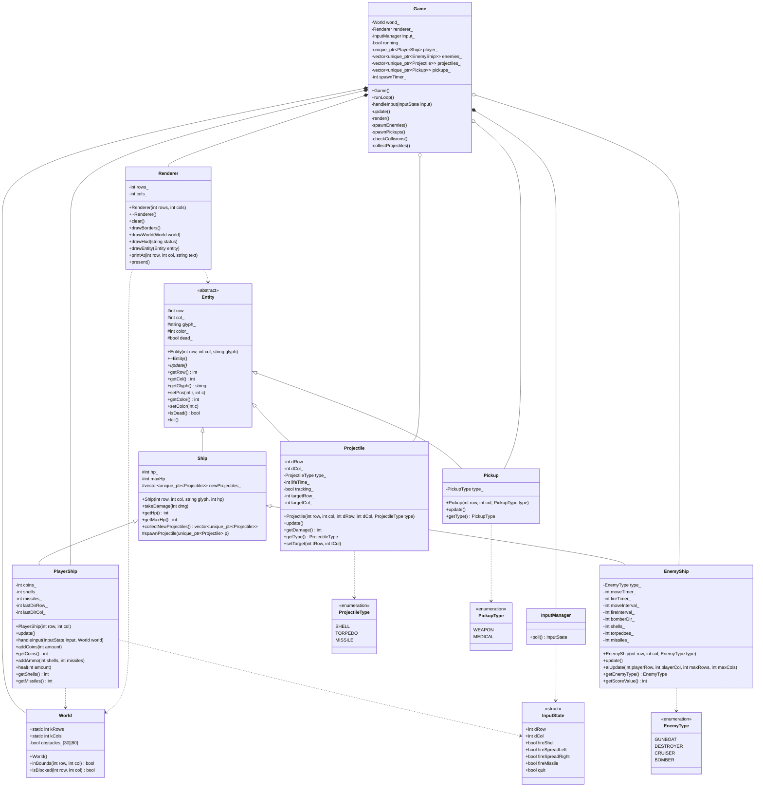

# Class Diagram

```mermaid
classDiagram
    class Entity {
        <<abstract>>
        #int row_
        #int col_
        #string glyph_
        #int color_
        #bool dead_
        +Entity(int row, int col, string glyph)
        +~Entity()
        +update()*
        +getRow() int
        +getCol() int
        +getGlyph() string
        +setPos(int r, int c)
        +getColor() int
        +setColor(int c)
        +isDead() bool
        +kill()
    }

    class Ship {
        #int hp_
        #int maxHp_
        #vector~unique_ptr~Projectile~~ newProjectiles_
        +Ship(int row, int col, string glyph, int hp)
        +takeDamage(int dmg)
        +getHp() int
        +getMaxHp() int
        +collectNewProjectiles() vector~unique_ptr~Projectile~~
        #spawnProjectile(unique_ptr~Projectile~ p)
    }

    class PlayerShip {
        -int coins_
        -int shells_
        -int missiles_
        -int lastDirRow_
        -int lastDirCol_
        +PlayerShip(int row, int col)
        +update()
        +handleInput(InputState input, World world)
        +addCoins(int amount)
        +getCoins() int
        +addAmmo(int shells, int missiles)
        +heal(int amount)
        +getShells() int
        +getMissiles() int
    }

    class EnemyShip {
        -EnemyType type_
        -int moveTimer_
        -int fireTimer_
        -int moveInterval_
        -int fireInterval_
        -int bomberDir_
        -int shells_
        -int torpedoes_
        -int missiles_
        +EnemyShip(int row, int col, EnemyType type)
        +update()
        +aiUpdate(int playerRow, int playerCol, int maxRows, int maxCols)
        +getEnemyType() EnemyType
        +getScoreValue() int
    }

    class Projectile {
        -int dRow_
        -int dCol_
        -ProjectileType type_
        -int lifeTime_
        -bool tracking_
        -int targetRow_
        -int targetCol_
        +Projectile(int row, int col, int dRow, int dCol, ProjectileType type)
        +update()
        +getDamage() int
        +getType() ProjectileType
        +setTarget(int tRow, int tCol)
    }

    class Pickup {
        -PickupType type_
        +Pickup(int row, int col, PickupType type)
        +update()
        +getType() PickupType
    }

    class World {
        +static int kRows
        +static int kCols
        -bool obstacles_[30][80]
        +World()
        +inBounds(int row, int col) bool
        +isBlocked(int row, int col) bool
    }

    class Renderer {
        -int rows_
        -int cols_
        +Renderer(int rows, int cols)
        +~Renderer()
        +clear()
        +drawBorders()
        +drawWorld(World world)
        +drawHud(string status)
        +drawEntity(Entity entity)
        +printAt(int row, int col, string text)
        +present()
    }

    class InputManager {
        +poll() InputState
    }

    class Game {
        -World world_
        -Renderer renderer_
        -InputManager input_
        -bool running_
        -unique_ptr~PlayerShip~ player_
        -vector~unique_ptr~EnemyShip~~ enemies_
        -vector~unique_ptr~Projectile~~ projectiles_
        -vector~unique_ptr~Pickup~~ pickups_
        -int spawnTimer_
        +Game()
        +runLoop()
        -handleInput(InputState input)
        -update()
        -render()
        -spawnEnemies()
        -spawnPickups()
        -checkCollisions()
        -collectProjectiles()
    }

    class InputState {
        <<struct>>
        +int dRow
        +int dCol
        +bool fireShell
        +bool fireSpreadLeft
        +bool fireSpreadRight
        +bool fireMissile
        +bool quit
    }

    class EnemyType {
        <<enumeration>>
        GUNBOAT
        DESTROYER
        CRUISER
        BOMBER
    }

    class ProjectileType {
        <<enumeration>>
        SHELL
        TORPEDO
        MISSILE
    }

    class PickupType {
        <<enumeration>>
        WEAPON
        MEDICAL
    }

    Entity <|-- Ship
    Entity <|-- Projectile
    Entity <|-- Pickup
    Ship <|-- PlayerShip
    Ship <|-- EnemyShip
    
    Game *-- World
    Game *-- Renderer
    Game *-- InputManager
    Game *-- PlayerShip
    Game o-- EnemyShip
    Game o-- Projectile
    Game o-- Pickup

    EnemyShip ..> EnemyType
    Projectile ..> ProjectileType
    Pickup ..> PickupType
    PlayerShip ..> InputState
    PlayerShip ..> World
    Renderer ..> World
    Renderer ..> Entity
    InputManager ..> InputState
```
