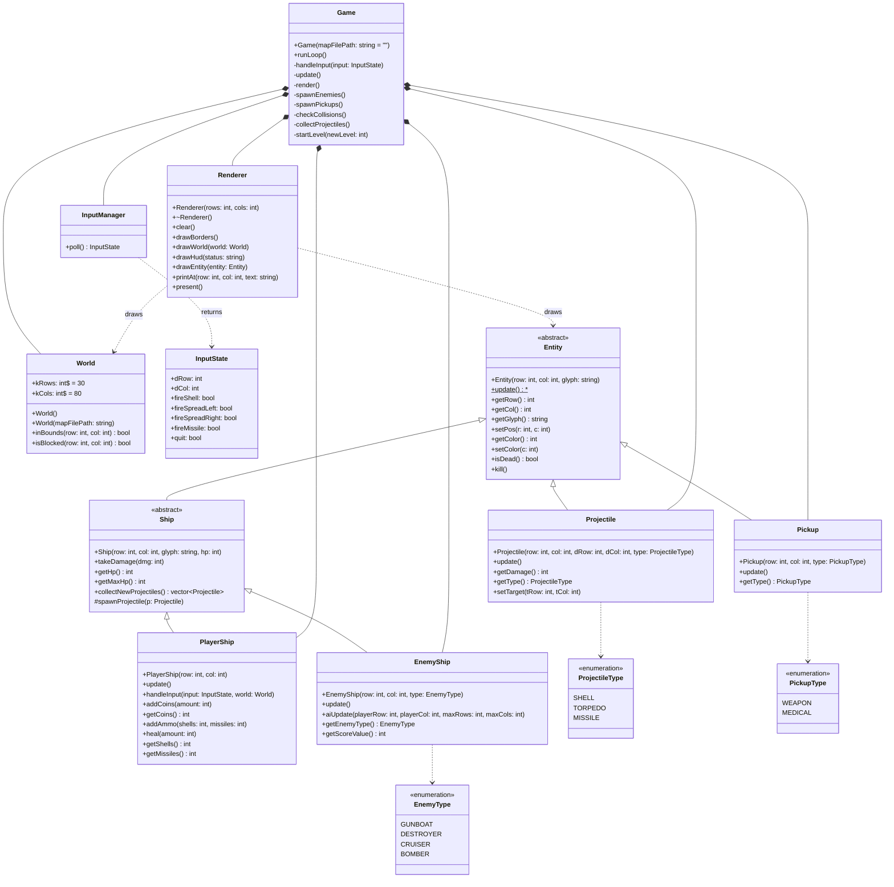

```mermaid
classDiagram
direction TB

class Game {
	+Game(mapFilePath: string = "")
	+runLoop()
	-handleInput(input: InputState)
	-update()
	-render()
	-spawnEnemies()
	-spawnPickups()
	-checkCollisions()
	-collectProjectiles()
	-startLevel(newLevel: int)
}

class World {
	+kRows: int$ = 30
	+kCols: int$ = 80
	+World()
	+World(mapFilePath: string)
	+inBounds(row: int, col: int) bool
	+isBlocked(row: int, col: int) bool
}

class Renderer {
	+Renderer(rows: int, cols: int)
	+~Renderer()
	+clear()
	+drawBorders()
	+drawWorld(world: World)
	+drawHud(status: string)
	+drawEntity(entity: Entity)
	+printAt(row: int, col: int, text: string)
	+present()
}

class InputManager {
	+poll() InputState
}

class InputState {
	+dRow: int
	+dCol: int
	+fireShell: bool
	+fireSpreadLeft: bool
	+fireSpreadRight: bool
	+fireMissile: bool
	+quit: bool
}

class Entity {
	<<abstract>>
	+Entity(row: int, col: int, glyph: string)
	+update()$*
	+getRow() int
	+getCol() int
	+getGlyph() string
	+setPos(r: int, c: int)
	+getColor() int
	+setColor(c: int)
	+isDead() bool
	+kill()
}

class Ship {
	<<abstract>>
	+Ship(row: int, col: int, glyph: string, hp: int)
	+takeDamage(dmg: int)
	+getHp() int
	+getMaxHp() int
	+collectNewProjectiles() vector~Projectile~
	#spawnProjectile(p: Projectile)
}

class PlayerShip {
	+PlayerShip(row: int, col: int)
	+update()
	+handleInput(input: InputState, world: World)
	+addCoins(amount: int)
	+getCoins() int
	+addAmmo(shells: int, missiles: int)
	+heal(amount: int)
	+getShells() int
	+getMissiles() int
}

class EnemyShip {
	+EnemyShip(row: int, col: int, type: EnemyType)
	+update()
	+aiUpdate(playerRow: int, playerCol: int, maxRows: int, maxCols: int)
	+getEnemyType() EnemyType
	+getScoreValue() int
}

class Projectile {
	+Projectile(row: int, col: int, dRow: int, dCol: int, type: ProjectileType)
	+update()
	+getDamage() int
	+getType() ProjectileType
	+setTarget(tRow: int, tCol: int)
}

class Pickup {
	+Pickup(row: int, col: int, type: PickupType)
	+update()
	+getType() PickupType
}

class EnemyType {
	<<enumeration>>
	GUNBOAT
	DESTROYER
	CRUISER
	BOMBER
}

class ProjectileType {
	<<enumeration>>
	SHELL
	TORPEDO
	MISSILE
}

class PickupType {
	<<enumeration>>
	WEAPON
	MEDICAL
}

%% Inheritance
Entity <|-- Ship
Ship <|-- PlayerShip
Ship <|-- EnemyShip
Entity <|-- Projectile
Entity <|-- Pickup

%% Composition / ownership (Game manages lifetime)
Game *-- World
Game *-- Renderer
Game *-- InputManager
Game *-- PlayerShip
Game *-- EnemyShip
Game *-- Projectile
Game *-- Pickup

%% Usage / dependencies
InputManager ..> InputState : returns
Renderer ..> Entity : draws
Renderer ..> World : draws
EnemyShip ..> EnemyType
Projectile ..> ProjectileType
Pickup ..> PickupType
```

